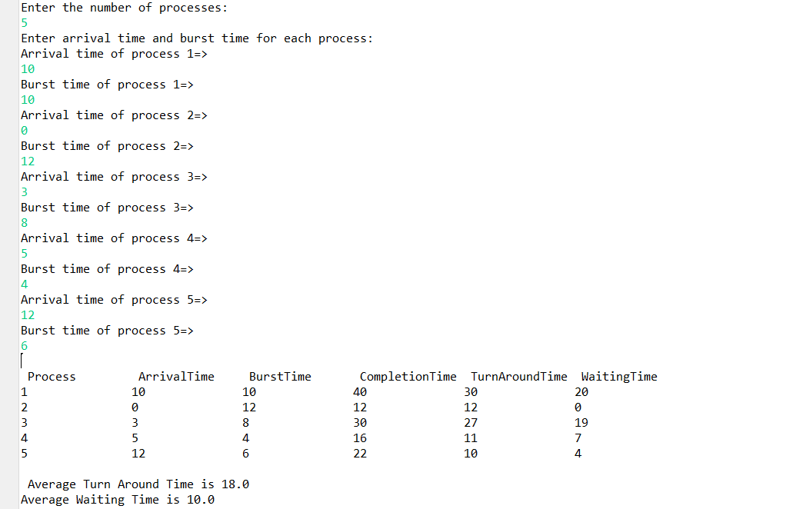
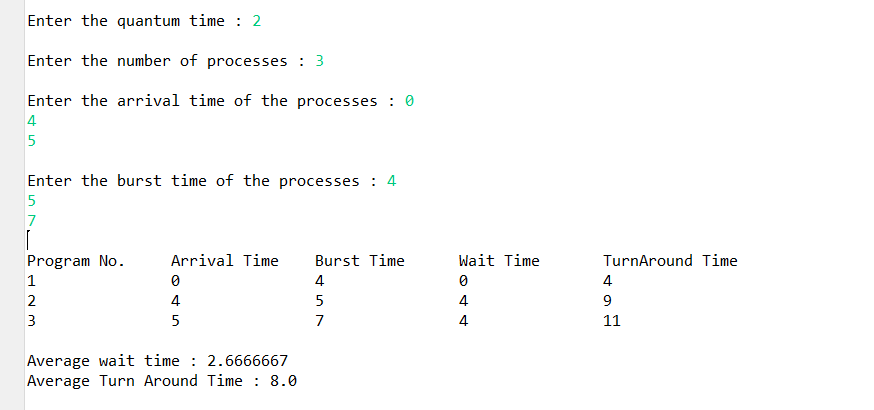

# CPU-Scheduling-Algorithms-SJF-and-RR-using-java

This project contains 2 algorithms: 1.Shortest Job First(SJF) , 2.Round Robin(RR) using java

## SJF Algorithm
Shortest Job First (SJF) is a type of disk scheduling algorithm in the operating system in which the processor executes the job first that has the smallest execution time. In the shortest Job First algorithm, the processes are scheduled according to the burst time of these processes.
check the code from  file

## RR Algorithm
In Round-robin scheduling, each ready task runs turn by turn only in a cyclic queue for a limited time slice. This algorithm also offers starvation free execution of processes.
check the code from  file

